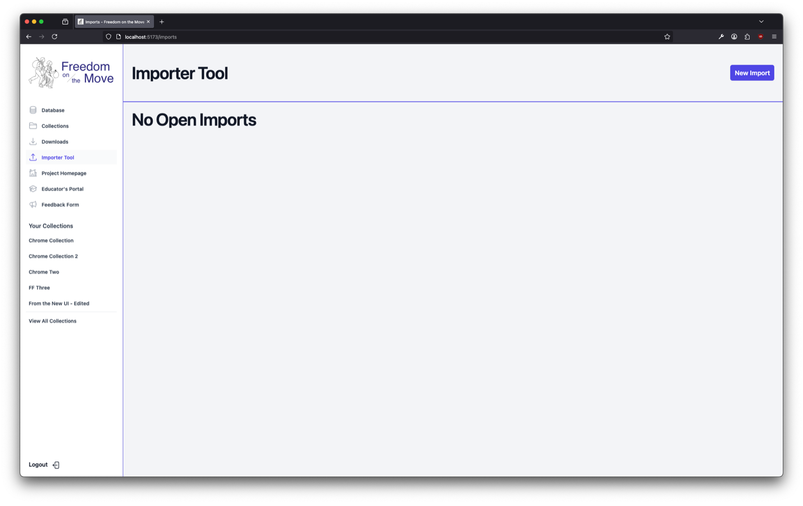
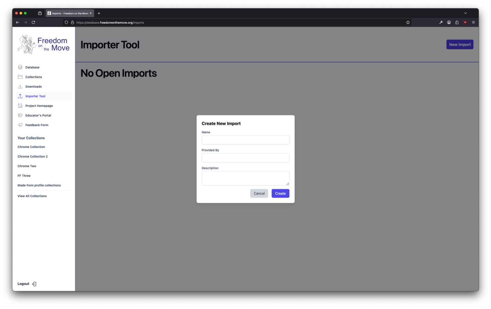
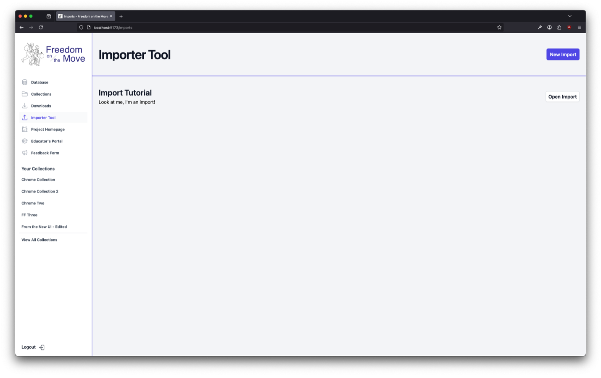
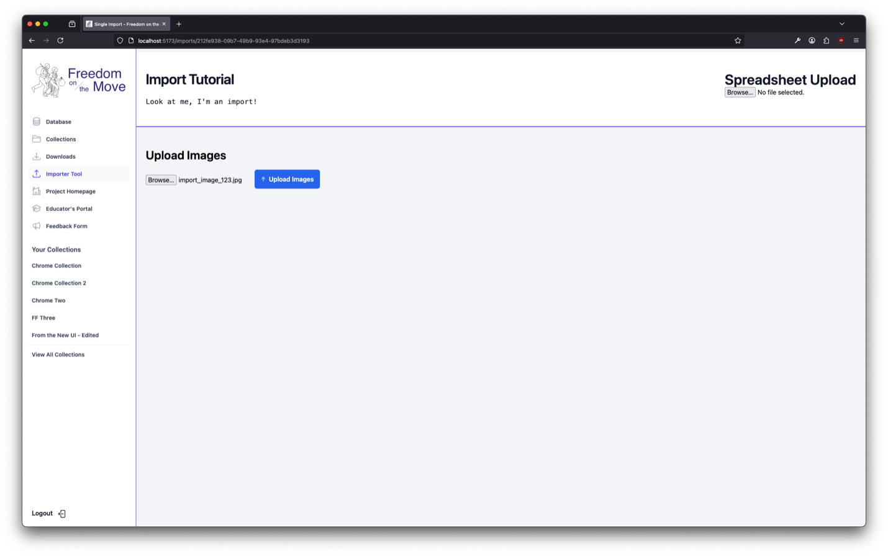
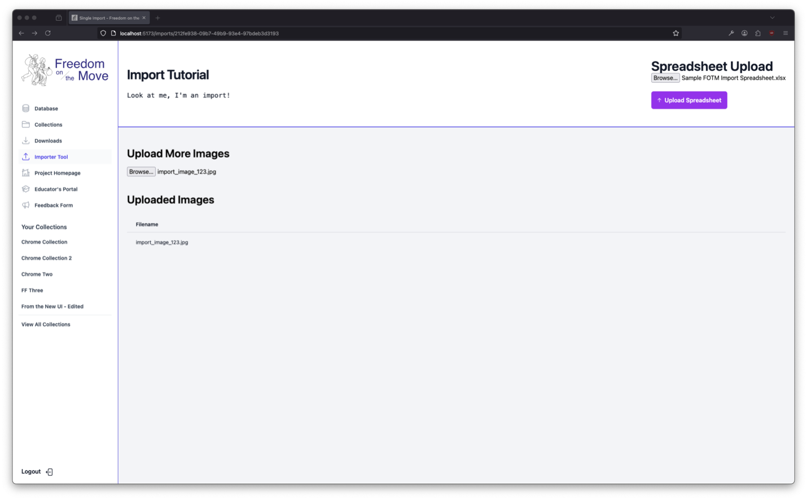
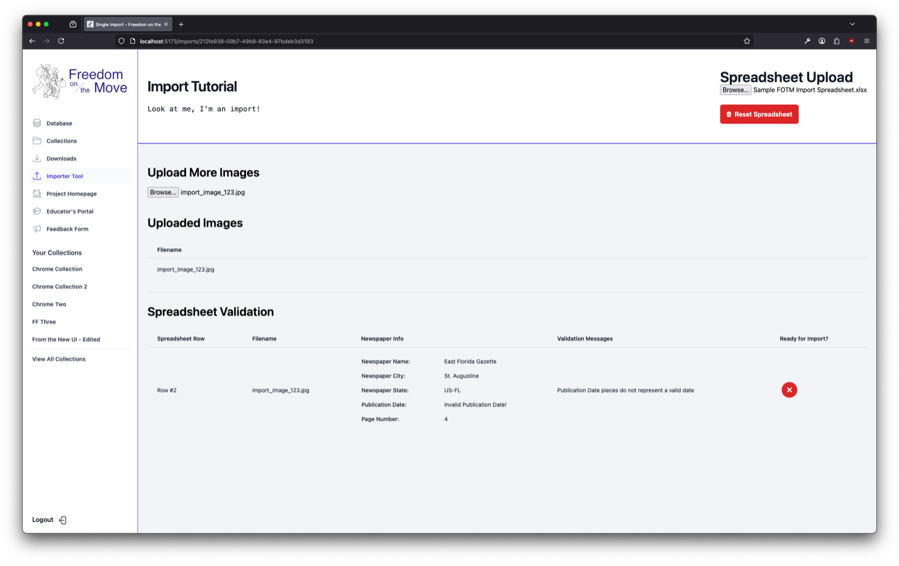
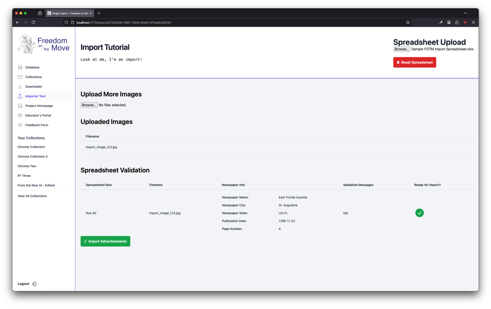

# Freedom on the Move Database Documentation

## Importing New Advertisements

1. Sign into FOTM with an admin account. On the sidebar, navigate to `Importer Tool`.

---

2. In the top right corner click on `New Import`.
3. Give it a name, who is providing the content and optionally a description. 
4. Click `Create`.

---

5. Click `Open Import` to enter your new import.

---

6. Under the `Upload Images` header click `Browse...`”.
7. Select the advertisement images that you want in this import.
8. Once selected click the blue `Upload Images` button.

---

9. Once the images are uploaded click the `Browse...` button under the `Spreadsheet Upload` header in the top right of the tool.
10. Select an `.xlsx` Excel file that uses the format y’all came up with.
11. Click the purple `Upload Spreadsheet` button to load the spreadsheet.

---

12. Once uploaded a new section will appear called `Spreadsheet Validation`.
    - If there is something wrong with the data in a row, it will be marked by an X in a red circle.

---

If the row’s data is in the correct format, you will see a checkmark in a green circle instead.

13. Once every row in your spreadsheet has a checkmark a green `Import Advertisement` button will appear. Clicking this will import everything into the database.
    - **NOTE:** The tool is not psychic! It will only detect data errors from a technical perspective (missing, invalid date, etc). You still carry the burden of historical accuracy.
    - **NOTE #2:** Please verify all data and image uploads prior to clicking the green import button.
      Once imported there is no way to remove ads without a technical user intervening. 

---

The advertisements will then appear in search within an hour or so. This delay is a cost saving measure.